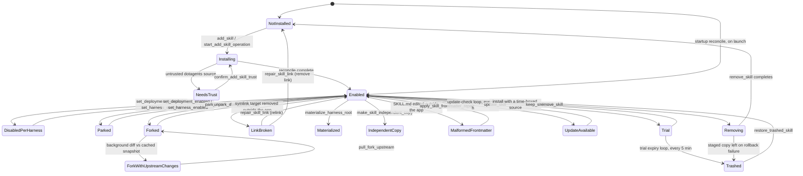

# Skill lifecycle states

One installed skill moves through a fixed set of states, and each state has its own combination of disk layout, registry record, and UI signal.
A state is a fact about the disk first; the registry and the UI both follow what a scan of the shared root and the per-harness links finds.

## States

| State                                | On disk                                                                                                                                                                                                    | UI                                                                                              |
| ------------------------------------ | ---------------------------------------------------------------------------------------------------------------------------------------------------------------------------------------------------------- | ----------------------------------------------------------------------------------------------- |
| Not installed                        | Nothing under any root                                                                                                                                                                                     | Store search result, or a target the Add Skill sheet has not yet written                        |
| Installing: Queued                   | In-memory operation state only, nothing durable yet (`skill_add_operation.rs:880`)                                                                                                                         | AddSkillSheet progress row                                                                      |
| Installing: Downloading / Extracting | Fetch or CLI in progress; Copy stages into `.skill-studio-install-<pid>-<nonce>-<i>`                                                                                                                       | AddSkillSheet progress row                                                                      |
| Installing: Deploying                | Stage renamed into place; ownership record about to be written                                                                                                                                             | AddSkillSheet progress row                                                                      |
| Installing: Needs trust              | Operation halted before any write, pending user confirmation (`skill_add_operation.rs:1054`)                                                                                                               | Trust prompt in AddSkillSheet (`AddSkillSheet.tsx:1174-1180`)                                   |
| Installed and enabled                | Entry under the shared root, a per-harness link (for example `~/.claude/skills/<name>`), no disable/park/trial record in the registry                                                                      | SkillLocationsCard row, enabled switch on                                                       |
| Disabled per harness                 | Copy owner: moved to `<root>/.skill-studio-disabled/`. Symlink owner: link removed and a `harness_disabled` registry bucket, or a native edit (`~/.codex/config.toml`, `~/.config/opencode/opencode.json`) | Per-harness switch off in SkillLocationsCard                                                    |
| Parked                               | Shared dir renamed `~/.agents/skills/<name>` -> `~/.agents/skills-parked/<name>`, Claude link removed, `ParkedRecord` in the registry                                                                      | Header shows Unpark instead of Park; Locations card Unpark control                              |
| Trial (with expiry)                  | Same disk layout as installed; registry carries a trial record with an expiry timestamp                                                                                                                    | InstalledSkillHeader Keep button; a 15-second toast with Restore once expired                   |
| Forked                               | `ForkRecord` in the registry; upstream snapshot cached at `<app_data>/skill-studio/forks-snapshot/<name>`; live dir detached from provider ownership                                                       | Header Fork/Un-fork toggle, Pull latest control                                                 |
| Fork with upstream changes           | Same as forked, plus a diff between the cached snapshot and the live upstream tree                                                                                                                         | Pull latest becomes actionable                                                                  |
| Link broken                          | Per-harness symlink target missing or dangling                                                                                                                                                             | SkillRepairCard prompt: Relink or Remove link                                                   |
| Materialized                         | Whole-root symlink converted to a real directory holding one link per skill; root registered                                                                                                               | MaterializeRootDialog; per-skill enable/disable via `set_shared_harness_skill_enabled`          |
| Independent copy                     | Link replaced by an owned directory copy; `copies` entry in the registry, no longer tracks upstream                                                                                                        | SkillLocationMenu "Make independent copy"; row loses the Relink control                         |
| Malformed frontmatter                | SKILL.md fails a frontmatter check; nothing on disk changes until repair runs                                                                                                                              | `SkillFrontmatterRepairDialog`, driven by the `spec_violations` flag                            |
| Update available                     | Registry's pinned entry mismatches the cached latest commit from the update-check loop (`skill_update_check.rs:872`, `update-check.json`)                                                                  | Home inbox Update entry, header Update button                                                   |
| Removing                             | Transient: staged into `skills-trash/.dotagents-link-remove-<pid>-<n>` or an equivalent stage for the owner kind, live paths not yet deleted                                                               | No progress state noted; a completion toast fires, currently mislabeled "Updated N deployments" |
| Trashed (restorable)                 | Moved under `~/.agents/skills-trash/`; registry record dropped except what restore needs                                                                                                                   | Trial-expiry toast Restore button, or a manual restore call                                     |
| Pack member                          | Skill folder lives inside the pack's own git repo at `~/.agents/packs/<name>`; a pack row in the registry lists member skill names                                                                         | PacksView row, expanded to show members, behind the `skill-packs` flag                          |

## Transitions

Five background loops can move a skill between states without a user click: the trial-expiry loop runs 15 seconds after startup and then every 5 minutes; the update-check loop runs every 6 hours; startup reconcile runs once, at launch, before any of the others; pack-staging reconcile also runs once, synchronously, before the loops start; and the refresh loop rebuilds the in-memory snapshot on demand but writes no state of its own. The diagram below marks only the two loops that change a skill's lifecycle state.

| From                       | To                        | Command                                      | Journaled today                 | Lock today                          | Crash mid-write leaves                                                                 | Desired guarantee                                                            |
| -------------------------- | ------------------------- | -------------------------------------------- | ------------------------------- | ----------------------------------- | -------------------------------------------------------------------------------------- | ---------------------------------------------------------------------------- |
| Not installed              | Installing                | add_skill (Copy/Dotagents/SkillsSh)          | No                              | ForkMutationLock                    | CLI partial writes on disk, or an unowned staged folder                                | Journal event with backup and inverse before the first write                 |
| Enabled                    | Disabled per harness      | set_deployment_enabled                       | Yes (`move_aside_disable`)      | ForkMutationLock                    | Move recorded and repairable                                                           | Same shape, under a per-scope lease                                          |
| Enabled                    | Disabled per harness      | set_harness_enabled                          | No                              | ForkMutationLock                    | Codex multi-path loop partly toggled, unreported                                       | Journal event, one transaction or a named compensating step per path         |
| Enabled                    | Parked                    | park_skill                                   | No                              | ForkMutationLock                    | Folder renamed but registry not yet written                                            | Journal event with a checked rollback, not `let _ =`                         |
| Parked                     | Enabled                   | unpark_skill                                 | No                              | ForkMutationLock                    | Unparked skill with a missing Claude link                                              | Same lease-scoped journal shape                                              |
| Enabled                    | Forked                    | fork_skill                                   | No                              | ForkMutationLock                    | Detached but empty skill dir                                                           | Journal event before the CLI removal step                                    |
| Fork with upstream changes | Forked                    | pull_fork_upstream                           | No                              | ForkMutationLock                    | Crash between two of the four renames                                                  | One transaction, or journal-and-inverse per rename                           |
| Forked                     | Enabled                   | unfork_skill                                 | No                              | ForkMutationLock                    | Stale fork record after a successful reinstall                                         | Journal event recorded before the reinstall discards local edits             |
| Enabled                    | Removing -> Not installed | remove_skill (Copy/Fork/dotagents/skills-sh) | No                              | ForkMutationLock                    | Stale trial record, staged trash left behind, or a stale backup path                   | One shared core write path with a journal event and startup reconciler       |
| Update available           | Enabled                   | update_skill                                 | No                              | ForkMutationLock                    | CLI partial writes stay on disk                                                        | CLI call, check-now, and rebuild as one transaction                          |
| Enabled                    | Materialized              | materialize_harness_root                     | Yes (`RecreateSymlink` inverse) | ForkMutationLock                    | Root stranded between symlink removal and directory rename if rollback also fails      | Same journal shape, per-scope lease                                          |
| Enabled                    | Independent copy          | make_skill_independent_copy                  | Yes                             | ForkMutationLock                    | Repaired by `reconcile_interrupted_independent_copy`                                   | Already the model; extend the lease scope                                    |
| Link broken                | Enabled / Not installed   | repair_skill_link                            | Yes                             | ForkMutationLock                    | Repairable, single syscall per action                                                  | Already meets the shape                                                      |
| Trial                      | Trashed                   | trial expiry loop (5 min)                    | No                              | ForkMutationLock, taken by the loop | No journal, no direct crash-window test                                                | Same journal treatment as foreground commands                                |
| Update pending             | Update checked            | update-check loop (6 h)                      | n/a, read-only network check    | in-progress guard                   | Failure only logged, `check_skill_updates_now` has no UI caller                        | A UI caller, or fold into the loop and drop the public command               |
| Any pending event row      | interrupted               | startup reconcile                            | n/a                             | none                                | Flips pending rows to `interrupted`, then runs three repairers (`lib.rs:26`, `:48-96`) | Extend the same reconciler to every journaled command, not the current eight |

## Per-harness view of one state

Each harness has its own discovery path, and the shared root under `.agents/skills` is the one location every first-class harness can read from without a copy: Claude Code, Codex, OpenCode, and pi each add a project or global path of their own on top of it. The three states below show how the same shared-root change reads differently per harness.

**Enabled.** Claude Code: symlink under `~/.claude/skills/<name>` resolves to the shared root; loads. Codex: reads the shared root directly by its own path convention; loads. OpenCode: same, its own skills path resolves; loads. pi: same; loads. Shared root: the entry exists under `~/.agents/skills/<name>`, the source of truth every harness link or read points back to.

**Disabled in Codex only.** Claude Code: link untouched; loads. Codex: `~/.codex/config.toml` marks the skill disabled (`skill_harness_disable.rs:741`); does not load. OpenCode: config untouched; loads. pi: untouched; loads. Shared root: entry unchanged, still present.

**Parked.** Claude Code: its link is removed as part of the park; does not load. Codex: no entry at the shared root's normal path to read, since the folder moved to `skills-parked/`; does not load. OpenCode: same; does not load. pi: same; does not load. Shared root: the entry itself moved to `~/.agents/skills-parked/<name>`, so no harness sees it at the expected path.

## Invariants

A doctor pass checks the disk against these six invariants, independent of any single command's own rollback logic, so a violation left by an old bug or a manual edit surfaces even when no command is running.

1. Every link resolves inside its root. Partly checked: `confine` and `ancestor_holds` (`crates/skill-studio-core/src/ports.rs:79`, `:116`) implement the check, but only inside the core's read/scan path; no doctor pass runs it against every existing link.
2. Every registry entry has a folder. Not checked today; no audit code found for this.
3. Every lockfile entry has a folder. Not checked today; the app only reads `~/.agents/.skill-lock.json`, never audits it (shared-state.md:14).
4. No folder is in two states at once (for example parked and trashed). Not checked today; no dedicated check found.
5. Quarantine stays within a retention cap. Not checked today; `skills-trash`, `skills-parked`, and fork snapshot directories have no retention limit at all (shared-state.md gaps).
6. The journal has no open plan at rest. Partly checked: `reconcile_at_startup` (`event_store.rs:351`) flips every pending row to `interrupted` and runs three repairers on launch (`lib.rs:26`, `:48-96`), but this only covers the 8 commands that journal today.

Nothing in this file changes what a scan reports; it only names the states a scan's output already implies.

## Gaps

- Park, unpark, fork, pull, and unfork write no journal event; only `make_skill_independent_copy`, `set_deployment_enabled`, `materialize_harness_root`, `set_shared_harness_skill_enabled`, and `repair_skill_link` do.
- All lifecycle-changing commands share one process-wide `ForkMutationLock`; a transition on one skill blocks an unrelated transition on another.
- `park_skill` and `unpark_skill`'s rollback writes use `let _ =`, discarding the result instead of checking or repairing it.
- `pull_fork_upstream`'s four-rename swap has no transaction boundary; a crash between renames is a named, unrepaired risk.
- `unfork_skill` writes the registry after the CLI reinstall already discarded local edits, so a write failure leaves a stale fork record.
- No invariant doctor pass exists; the five checks above that are "not checked" have no code path at all, journaled or not.
- Trashed, parked, and fork-snapshot directories accumulate with no retention limit or scheduled cleanup.
- `restore_trashed_skill` does not clean up a half-written target or the trash copy when its entry-count check fails.
- The header Remove button's success toast reads "Updated N deployments," which does not name the Removing-to-Not-installed transition it just completed.
- `check_skill_updates_now` has no UI caller; the Update-available state can only be reached through the 6-hour background loop.
