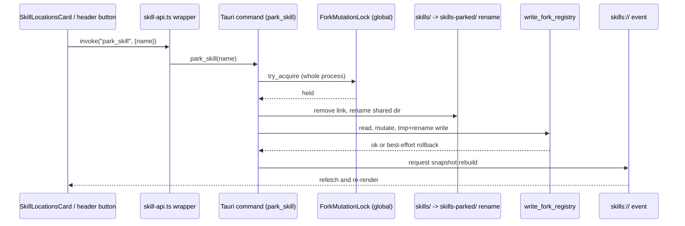
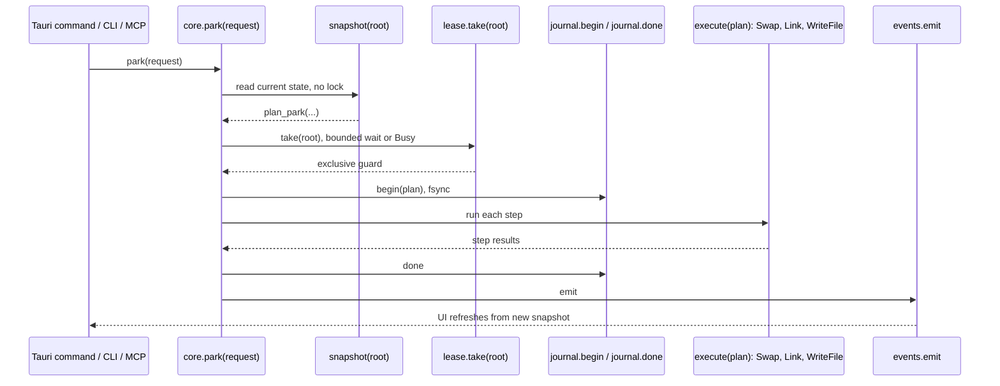

# System overview

Skill Studio manages agent skills on disk across five harnesses, and the core has to guarantee that a write either lands whole or leaves a repairable trace, never a half-written folder with no record of what was mid-flight.

## The primitives

| Primitive | Guarantee                                                            | What exists today                                                                                                                                                                                                                                                                                                                                                                                                                                                            | Used by                                             |
| --------- | -------------------------------------------------------------------- | ---------------------------------------------------------------------------------------------------------------------------------------------------------------------------------------------------------------------------------------------------------------------------------------------------------------------------------------------------------------------------------------------------------------------------------------------------------------------------- | --------------------------------------------------- |
| Root      | A path can never leave its opened folder                             | None as a handle type. `confine` (`crates/skill-studio-core/src/ports.rs:79`) and `ancestor_holds` (`ports.rs:116`) do the path-confinement check, but only inside the read-side `ScopeFs`/`NormalizedScope` path, not as a reusable handle desktop mutation code takes                                                                                                                                                                                                      | reads-and-snapshot.md, shared-state.md              |
| Snapshot  | A pure, lock-free read of one root                                   | `scan` (`crates/skill-studio-core/src/ops.rs:262`), returning an `Inventory` DTO                                                                                                                                                                                                                                                                                                                                                                                             | reads-and-snapshot.md                               |
| Stage     | A temp folder so the final move is one rename                        | None as a shared primitive. Each mutation command builds its own temp name: `.skill-studio-install-<pid>-<nonce>-<i>` in `skill_add.rs`, a staging dir in `skill_independent_copy.rs`, `staging-live`/`staging-base` in `skill_fork.rs`                                                                                                                                                                                                                                      | install.md, park-fork-trial.md, enable-and-links.md |
| Swap      | Atomic replace via quarantine-then-move-in, never delete             | None as a shared primitive. Desktop hand-rolls renames per command: `park_skill`'s single rename (`skill_park.rs:210`), `pull_fork_upstream`'s four manual renames (`skill_fork.rs:1404`)                                                                                                                                                                                                                                                                                    | park-fork-trial.md, remove-and-update.md            |
| Link      | Write a symlink under a temp name, rename over the target            | None as a shared primitive. `repair_skill_link` and `materialize_harness_root` each write links directly (`event_commands.rs:529`, `:273`)                                                                                                                                                                                                                                                                                                                                   | enable-and-links.md                                 |
| WriteFile | Temp file, fsync, rename, refuse on stale read                       | None as a shared core primitive. `write_fork_registry` (`skill_fork_registry.rs:372`) is the desktop's own tmp-plus-rename writer for the registry only; `write_installed_skill_md_if_unchanged` does the stale-read check for SKILL.md separately                                                                                                                                                                                                                           | shared-state.md, skill-md-editing.md                |
| Journal   | Plan written and fsynced before step one, marked done after the last | Present: the `Journal` port (`crates/skill-studio-core/src/ports.rs:627`) and `FsJournal` (`crates/skill-studio-core/src/journal.rs:42`), journaling `fsops`'s Stage/Swap/Link/WriteFile one `PlanRecord` per plan, with `reconcile` (`journal.rs:359`) on startup. Not yet wired to a command: `event_store.rs`'s SQLite WAL log is still the only journal a command writes to, with its own `reconcile_at_startup` (`event_store.rs:351`); 8 of 46 writing commands use it | events-and-history.md                               |
| Lease     | One writer per root, with a clear Busy error                         | `skill_studio_host::lease::FileLease` (`crates/skill-studio-host/src/lease.rs:17`), an advisory file lock per canonical root, implementing the core's `LeaseProvider` port (`ports.rs:355`)                                                                                                                                                                                                                                                                                  | reads-and-snapshot.md (wired to `scan` only)        |
| Source    | Resolve a user string into a repo, ref, and subpath                  | None as a shared parser. Each install method (`skill_add.rs`) builds its own argv for the CLI instead of resolving a source value itself                                                                                                                                                                                                                                                                                                                                     | install.md                                          |
| Fetch     | Bounded, timed download into a stage                                 | None as a shared primitive. Install and fork both shell out to CLIs or fetch upstream trees (`skill_fork.rs:960`) with no documented size cap or timeout in the core                                                                                                                                                                                                                                                                                                         | install.md, park-fork-trial.md                      |
| TreeHash  | A local git tree SHA matching GitHub and the CLI                     | Present: `tree_hash::tree_hash` (`crates/skill-studio-core/src/tree_hash.rs:44`), a pure `ScopeFs` walk reimplementing git's blob/tree object hashing. `skill_content_hash` (`ops.rs:2137`) still computes its own, unrelated sha256 fingerprint for the app's own change detection                                                                                                                                                                                          | install.md, unit 1.4                                |

As of unit 1.1, `fsops` (`crates/skill-studio-core/src/fsops.rs:1`) implements Root, Stage, Swap, Link, and WriteFile behind `ScopeFs`'s new `fsops_*` methods, tested against `FixtureFs` and, for the crash case, real disk; no mutation path calls it yet, so the "What exists today" cells above still describe what desktop actually runs.

The desktop crate still owns almost all of this. `apps/desktop/src-tauri/src/skills/commands.rs` alone declares 76 `#[tauri::command]` functions (the README's project-wide count is 71, folding in duplicates and near-misses across files); the area map's own headline count puts 46 of those at writing to disk. The core crate's `ops.rs` has 8 public operations total, and only two of them mutate anything: `apply_frontmatter_repair` (`ops.rs:2636`) and `restore_event` (`ops.rs:2844`). Every park, unpark, fork, pull, unfork, remove, update, install, enable, and materialize path still lives entirely in the desktop crate.

## The call stack

Desired, from the design extract:

```
Tauri command install_skill(request)          adapter, also CLI and MCP
  core.install(request)                       public API, one function per operation
    source.resolve  ->  fetch.to_stage        network, bounded
    snapshot(root)  ->  plan_install(...)     pure, no I/O
    lease.take(root)
      journal.begin(plan)
      execute(plan)                           Swap, Link, WriteFile lockfile entry
      journal.done
    events.emit  ->  UI refreshes from the new snapshot
```

Today, for `park_skill`:

```
Tauri command park_skill                       commands.rs entry point
  skill_park::park_skill(...)                  skill_park.rs:463
    ForkMutationLock::try_acquire               skill_fork.rs:949, :953 (global, process-wide)
      remove Claude link                        skill_park.rs (rename step)
      rename skills/<name> -> skills-parked/<name>   skill_park.rs:210
      insert ParkedRecord, retarget trial        skill_park.rs:242, :254
      write_fork_registry (tmp + rename)         skill_fork_registry.rs:372
    (no journal event)
  request snapshot rebuild -> UI refetches
```

The two stacks differ in five ways. First, the desired stack separates a pure planning phase from the lease and the execute phase; `park_skill` goes straight from the Tauri entry point into taking the lock, with no snapshot-then-plan step in between. Second, the desired stack takes a lease scoped to the one root being touched; `park_skill` takes the same process-wide `ForkMutationLock` that every other lifecycle command shares, so parking one skill blocks forking an unrelated one. Third, the desired stack journals the plan before executing any step; `park_skill` never writes a journal event, so a crash between the rename and the registry write has no recorded plan for a startup reconciler to replay, only the best-effort `let _ =` rollback already in the code. Fourth, the desired stack's execute step is built from named, shared primitives (Swap, Link, WriteFile); today's `park_skill` hand-writes its own rename and its own registry read-modify-write, a pattern repeated with small variations in `unpark_skill`, `fork_skill`, and every remove variant. Fifth, both stacks end by telling the UI to refresh, but the desired flow's event comes out of a committed journal entry, while today's is a full snapshot rebuild request with no link to what specifically changed.

## How a write flows, today and desired





## Budgets and resilience

| Budget                                          | Met today      | Evidence                                                                                                          |
| ----------------------------------------------- | -------------- | ----------------------------------------------------------------------------------------------------------------- |
| Full scan under 100 ms, no hashing              | No claim found | No benchmark files anywhere in the repo (`find . -iname "*bench*"` returns nothing)                               |
| Any local mutation under 50 ms                  | No claim found | Same; no timing test or bench harness for park, fork, remove, or install                                          |
| UI event within one frame of the journal commit | Partly         | Journal exists for only 8 commands; the rest emit a full snapshot-rebuild request instead of a frame-scoped event |

| Failure mode                           | Defended today | Evidence                                                                                                                                                                                                                                      |
| -------------------------------------- | -------------- | --------------------------------------------------------------------------------------------------------------------------------------------------------------------------------------------------------------------------------------------- |
| Crash after any step                   | Partly         | Only `set_deployment_enabled`, `set_shared_harness_skill_enabled`, `materialize_harness_root`, `repair_skill_link`, `make_skill_independent_copy` journal and reconcile; park, unpark, fork, pull, unfork, remove, update, and install do not |
| A second process writing the same root | Yes            | Every mutation command takes a per-root `WriteLease` (`write_lease.rs:25`), a `FileLease` keyed to the root, so a concurrent CLI or MCP write on the same root is refused, not just an in-process one                                         |
| Disk full                              | Partly         | Rename-based writes fail without corrupting, but no command names a disk-full path specifically                                                                                                                                               |
| No permission                          | Partly         | `CoreError::io` wraps IO errors generically; no primitive-level permission check                                                                                                                                                              |
| A symlink loop                         | No             | No loop guard found in `confine` or `ScopeFs`                                                                                                                                                                                                 |
| A path that escapes the root           | Partly         | `confine` (`ports.rs:79`) exists for exactly this, but only the core read path uses it; no desktop mutation command calls it                                                                                                                  |
| A folder that grew to gigabytes        | No             | `skill_content_hash`'s byte cap (`ops.rs`) bounds hashing only, not a write's folder size                                                                                                                                                     |
| A network stall                        | Partly         | Install and fork shell out or fetch with no documented timeout in the core; `list_github_skills` alone caches                                                                                                                                 |
| Two app instances                      | No             | Same gap as the second-process case; no cross-process lock guards desktop mutation commands                                                                                                                                                   |

| Defense named in the extract                             | Present today | Evidence                                                                                                                                                                                      |
| -------------------------------------------------------- | ------------- | --------------------------------------------------------------------------------------------------------------------------------------------------------------------------------------------- |
| Journal before mutate                                    | Partly        | 8 of 46 writing commands journal (enable-and-links.md, events-and-history.md)                                                                                                                 |
| Swap instead of delete                                   | Partly        | Park, remove, and fork rename into `skills-trash`/`skills-parked` instead of deleting; `pull_fork_upstream`'s four-rename swap is manual, not atomic (`skill_fork.rs:1404`)                   |
| Quarantine with a retention cap                          | Partly        | `skills-trash` and `skills-parked` exist as quarantine locations; no retention cap on either (shared-state.md gaps)                                                                           |
| Compare the hash before any destructive step             | Partly        | Copy and Fork remove fingerprint-check staged trash before deleting live paths (remove-and-update.md:26, :28); not universal                                                                  |
| Bounded fetch                                            | No            | No `Fetch` primitive; install and fork shell out with no documented cap                                                                                                                       |
| Per-root leases                                          | Yes           | `WriteLease` (`write_lease.rs:25`) wraps `FileLease` (`lease.rs:17`), keyed to the root each command's `home` resolves to                                                                     |
| A doctor that checks invariants at startup and on demand | Partly        | `lib.rs` runs several targeted reconcilers at startup (event store, frontmatter repair, independent copy, convert-then-disable, pack staging) but no unified cross-root invariant pass exists |

## What the two stacks built against this picture

The Claude stack delivered the read side and the adapter shape this picture assumes. PR #73 built `ScopedPath`, `confine`, the port traits (`ScopeFs`, `LeaseProvider`, and the rest of `ports.rs`), and split the code into `skill-studio-core` and `skill-studio-host`, with the CLI, MCP server, and TUI standing on the same core. That PR also carries the golden-fixture harness that checks the extracted `scan` path against the old desktop output, and `FileLease` (`lease.rs`) is the one working lease implementation, wired to `scan`. PR #105 moved tracked-project state into the core and gave the CLI, MCP server, and desktop one shared discovery implementation. None of these PRs touch a mutation command's write order, locking, or journaling; every area file notes the extraction as the only Claude-stack change in its area.

The Codex stack delivered durable, root-handle-style mutations, built directly in the desktop crate rather than as shared core primitives. #94 made Copy removal atomic and recoverable with quarantine and a startup retry; #113 and #123 made Dotagents and skills.sh Fork durable with event-bound locks and deadline/byte/entry/depth caps on the fetch; #128 made Pull's swap atomic with interrupted-pull recovery; #133 made Unfork durable with the same publication-record pattern; #135 and #136 gave Copy visibility and trial restore the same atomic-replace-and-recover shape. Each of these is close to the extract's Root-handle-plus-Swap-plus-quarantine-plus-recovery idea, but implemented per command, not as one shared primitive other operations can reuse.
