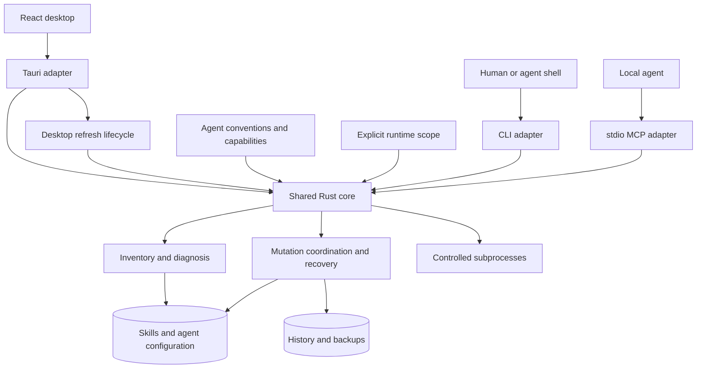

# Shared core, headless access, performance, and observability

Status: Draft for implementation planning. Not implemented or performance-validated.

Date: 2026-09-08.

## Scope

Skill Studio retains its Tauri desktop interface and gains a shared Rust core, a synchronous CLI, and a local stdio MCP interface. All interfaces use the same ownership, diagnosis, mutation, and restore rules.

This specification covers production visibility for the desktop, CLI, existing Hono API, and marketing site. It defines performance measurements and release gates. It preserves the existing user workflows listed in [Workflow contracts](./spec-workflow-contracts.md).

Hosted MCP, Cloudflare migration, remote laptop control, an always-running daemon, and a new background job service are out of scope. Blank skill creation and plugin installation are also out of scope.

The first headless mutation workflow is the existing narrow frontmatter repair followed by history and restore. Other workflows migrate in later phases. A CLI does not imply immediate support for every desktop feature.

## Architecture

Proposed module boundaries:

| Module                     | Owns                                                                                              | Does not own                                                          |
| -------------------------- | ------------------------------------------------------------------------------------------------- | --------------------------------------------------------------------- |
| `crates/skill-studio-core` | Inventory, diagnostics, agent conventions, guarded operations, history, explicit filesystem scope | Tauri types, React, protocol parsing, global telemetry initialization |
| `apps/cli`                 | Argument parsing, JSON output, exit status, cancellation, local MCP transport                     | Duplicate business rules or hidden desktop startup                    |
| Existing Tauri crate       | Native window operations, IPC, event delivery, desktop worker lifecycle                           | A separate implementation of migrated operations                      |
| `packages/lib`             | Frontend DTO consumption, display labels, UI selectors                                            | A second canonical diagnosis or ownership policy                      |
| Existing Hono app          | Catalogue proxy and API instrumentation                                                           | Local skill mutation or hosted MCP                                    |

The paths above describe proposed modules. Rust workspace configuration and packaging are implementation work.

The desktop calls the core in-process. It does not launch a CLI subprocess for each action. Blocking filesystem and subprocess work runs outside the UI thread with bounded concurrency.

Adapters have separate responsibilities. Interface adapters handle Tauri, CLI, and MCP. Agent conventions describe roots, ownership, configuration formats, and supported actions. Environment scripts handle dependency setup, process launch, and evidence collection for local and cloud machines.

The core owns supported agent facts. Discovery support does not imply runner support or native disable support. A cloud agent operates on its own machine's scope.

## Runtime scope and read behavior

`RuntimeScope` contains the home root, project selection, history root, and auxiliary cache paths. `ProjectSelection` distinguishes explicit projects from discovery. Requests can exclude projects without deleting their skills.

The core normalizes roots before deriving deployment or lock identities. Aliased roots are deduplicated. The home root cannot also be a project. Overlapping project roots require deterministic deduplication or an explicit unsupported result, never duplicate mutation targets.

The CLI resolves default user paths at its boundary and reports the effective scope. The core does not call `dirs::home_dir()` while processing an explicitly scoped request. Scope covers lock files, ownership ledgers, plugin roots, invocation data, run history, update state, and backups.

Fixture mode supplies all roots. It never falls back to the real user's home, caches, history, or agent configuration. Separate history directories cannot bypass coordination for the same physical deployment roots. Live scopes use a shared history and coordination identity. Arbitrary history overrides require isolated fixture roots.

Default `scan` and `doctor` are read-only. They do not create a database, save caches, start watchers, run update checks, expire trials, or reconcile interrupted events. Optional cache writes require an explicit runtime policy. Reading usage data does not itself authorize a cache write.

Read operations report unreadable paths and partial results. A failed scan cannot return a healthy diagnosis. Scan acquires shared read coordination for its physical scope before reading authoritative state. It holds that coordination through snapshot construction, excluding cooperating writers.

Read coordination waits at most two seconds by default. An explicit request can select another finite timeout. Timeout returns `scope_busy`, no authoritative inventory, and CLI exit status 3. An acquired scan with unreadable or externally inconsistent input returns an incomplete result and exit status 4. Adapters preserve this distinction. Read coordination does not change persistent application data.

Tracked projects and exclusions migrate from desktop-only persistence into shared configuration. Migration preserves existing selections and runs once with a version marker. Explicit CLI project selection can override discovery without rewriting saved preferences.

## Core operation contracts

The following method names define responsibilities, not final Rust signatures.

| Operation                    | Input                                                   | Output and guarantees                                                                 |
| ---------------------------- | ------------------------------------------------------- | ------------------------------------------------------------------------------------- |
| `scan`                       | Runtime scope, project selection, requested projections | Inventory, effective scope, completeness, observations, and schema version            |
| `diagnose`                   | Complete or explicitly partial inventory                | Stable issue codes, affected deployment IDs, supporting facts, supported next actions |
| `preview_frontmatter_repair` | One exact deployment ID                                 | Original fingerprint, proposal ID, diff, permitted modes, scope identity              |
| `apply_frontmatter_repair`   | Bound preview fields and chosen mode                    | Terminal outcome, affected deployments, event ID when recorded                        |
| `list_events`                | Scope, filters, pagination                              | Recorded events with actual restore capability and drift state                        |
| `restore_event`              | Event ID, scope, explicit force option                  | Guarded inverse result and new event ID                                               |
| `capabilities`               | Scope and selected agent                                | Supported operations and reasons for unavailable actions                              |

Canonical diagnostic kinds and evidence move from `collectDashboardIssues` into the core. UI labels and grouping remain in TypeScript. Contract fixtures prove that the migration preserves issue meaning. Normalization excludes transient timestamps when comparing interfaces.

The initial repair supports only the existing unquoted-colon case in one top-level `name` or `description` scalar. It is not a general YAML repair operation. Plugin, linked-root, managed-copy, and fork modes retain their existing restrictions.

## Mutation ownership and recovery

All cooperating desktop, CLI, and MCP writers acquire the same OS-backed mutation lease for the physical scope. In-process mutexes alone are insufficient. The lease identity cannot depend only on a caller-selected data directory.

The lease covers fresh target resolution, ownership checks, history intent, ledger or registry changes, file writes, and event completion. Recovery takes the same lease. Lock acquisition has a bounded wait and returns a structured busy result on timeout.

Read-only startup never changes pending event status. Recovery changes a pending operation only after exclusive ownership establishes that no cooperating live writer owns it. A held lease prevents another process from marking the active operation interrupted.

Application order for the initial repair is:

1. Acquire the scope mutation lease.
2. Recover eligible interrupted operations in that scope.
3. Resolve the exact deployment from fresh state.
4. Revalidate scope, ownership, permitted mode, proposal ID, and original bytes.
5. Create the backup and persist pending intent with an inverse.
6. Apply any required ownership transition and recheck the source fingerprint.
7. Replace the file atomically and mark the event complete.
8. Release the lease and notify affected desktop views.

A stale preview returns a conflict before the new repair changes files or records a repair event. Recovery of a separate prior operation is reported separately.

External editors do not participate in the lease. Fingerprint checks detect observed drift but do not eliminate every external-editor race between a check and rename. The API does not claim a universal filesystem transaction.

History remains authoritative locally when telemetry fails. Recorded events can lack an inverse. Restore is exposed only when the event supports it. Force restore requires an explicit caller choice and preserves current drift before replacement.

Restore acquires the same exclusive mutation lease and resolves the stored inverse against the current scope. It validates affected paths, current ownership restrictions, expected absent targets, and backup paths before writing. Restoring a removed deployment does not require that deployment to exist in the current inventory.

Inverse paths cannot escape the authorized scope through traversal or changed parent symlinks. Backup reads are confined to the event's validated backup storage. The operation claims the event once, checks current fingerprints, persists any required backup and restore intent, applies the inverse, then records completion. A forced replacement starts only after the current drift backup is durable. Failed backup persistence prevents replacement. Recovery handles an interrupted restore under the same lease.

## CLI contract

Initial commands are `scan`, `doctor`, `capabilities`, `repair preview`, `repair apply`, `history`, and `restore`. These names are proposed public commands. `mcp serve` starts the later local MCP interface.

The CLI accepts an explicit project scope and isolated fixture roots. It supports human output and `--json`. JSON mode emits one versioned terminal result to stdout. Logs and progress use stderr. MCP mode reserves stdout for protocol messages.

The result envelope contains `schema_version`, `operation`, `scope`, `status`, `data`, and `errors`. Error entries use stable codes and bounded, sanitized messages. Relevant results include deployment IDs, a correlation ID, and an audit event ID when one exists.

| Exit status | Meaning                                                   |
| ----------- | --------------------------------------------------------- |
| 0           | Operation succeeded; `doctor` found no issues             |
| 1           | `doctor` completed and found issues                       |
| 2           | Invalid request, unsupported action, or execution failure |
| 3           | Busy scope, stale proposal, or drift conflict             |
| 4           | Incomplete scan or diagnosis                              |
| 130         | Caller cancellation                                       |

Incomplete diagnosis takes precedence over issue status. Consumers use structured error codes for detail. Commands never prompt interactively in JSON mode. A required trust or force choice returns an actionable error when absent.

Commands run synchronously and return terminal results. Existing expiring in-memory install progress is not a durable CLI job API. Cancellation propagates to child processes and leaves persisted state recoverable. Telemetry shutdown has a bounded flush.

## Local MCP contract

The agent client launches `skill-studio mcp serve` on the machine containing the skills. The process uses the same runtime scope and core methods as the CLI.

Initial tools correspond to scan, diagnosis, capabilities, repair preview, repair apply, history, and restore. Tool schemas preserve the CLI's target, conflict, and completeness semantics. Tool descriptions state effects and restrictions. Tool annotations are advisory; the core enforces the actual policy.

Read tools do not run recovery or background maintenance. Write tools require the same bound proposal and lease as CLI and Tauri. A tool cannot substitute an arbitrary path for an exact deployment target. The local server does not expose an unrestricted shell tool.

Repeated calls do not gain authorization through cached UI state. A proposal is valid only while its scope, target, original bytes, and permitted mode still match. Restoring or applying twice returns a defined conflict or already-completed result without repeating the mutation.

CLI access remains available when MCP registration is broken. Hosted MCP is excluded from this specification.

## Desktop behavior

The desktop retains its window, navigation, editing, installation, and agent workflows. Each migrated command becomes a thin adapter over the core. Existing callers migrate before duplicate internal implementations are deleted.

The desktop owns background refresh, update checks, and trial expiry. The first CLI slice does not start those services. Desktop snapshots retain revision ordering and subscribe-before-read behavior.

The UI keeps the last valid inventory visible during refresh. An operation shows accepted, running, committed, failed, or cancelled state. A successful animation or toast cannot precede the backend's committed result.

Confirmed local operations can update affected rows promptly. External filesystem bursts use coalesced refresh. A full-to-delta snapshot change requires measured benefit and consistency tests.

Long transcript streams use bounded rendering work. Any event-buffer change preserves sequence, final text, cancellation, and saved history. Any list virtualization preserves keyboard navigation, selection, accessibility, and scroll position.

Animations are short, interruptible, and respect reduced motion. Animation completion does not block input or backend completion. A background operation must not trigger an animation for every row or every transcript event.

## Performance measurement and budgets

The baseline uses release builds before core extraction. Every artifact records commit, OS, hardware, toolchain, fixture seed, cache state, telemetry mode, and raw samples.

Fixtures contain 100, 1,000, and 10,000 skills. Independent dimensions include deployments, projects, plugin trees, skill bytes, invocation bytes, symlinks, inaccessible paths, and filesystem churn. Mutation runs reset fixtures outside the timed interval.

| Area         | Required measurements                                                                             |
| ------------ | ------------------------------------------------------------------------------------------------- |
| CLI          | Startup, wall time, CPU time, peak memory, output bytes, phase durations                          |
| Core         | Discovery, parsing, diagnosis, assembly, lock wait, backup, database and file writes              |
| Desktop      | First usable inventory, input-to-feedback, snapshot-to-paint, frame times, DOM count              |
| Memory       | Idle footprint, operation peak, retained growth after repeated cycles, child processes separately |
| Agent stream | Event rate, transcript size, render cost, memory growth, cancellation delay                       |
| API          | Request latency, upstream time, throughput, errors, payload bytes                                 |
| Marketing    | LCP, INP, CLS, JavaScript and media bytes, representative mobile behavior                         |
| Telemetry    | CPU, memory, network, and shutdown overhead against the same workload                             |

Fresh CLI process, empty application cache, warm OS cache, and persistent MCP process are separate cases. A process restart does not establish a cold disk cache. Samples report distribution and sample count. Small samples do not establish p99 behavior.

Desktop memory includes the Rust process and relevant webview helpers. Installer and agent children are reported separately. Shared memory is not counted as unique memory by summing RSS without qualification.

Proposed interaction budget: input feedback at p95 below 100 ms on designated reference hardware. Frame work fits the refresh interval, 16.7 ms at 60 Hz and 8.3 ms at 120 Hz. These are targets, not current results.

Absolute scan and RAM budgets remain unset until the baseline exists. Phase 0 must record reference hardware, baseline artifacts, per-fixture budgets, and regression tolerances before performance acceptance can pass. The performance report distinguishes completed work from perceived response time.

## Observability contract

Instrumentation covers desktop React, Rust, CLI, the existing Hono API, and marketing React. No hosted MCP instrumentation is required.

| Component     | Required signals                                                                       |
| ------------- | -------------------------------------------------------------------------------------- |
| Desktop React | Render errors, startup and action spans, IPC duration, input and paint measurements    |
| Rust and CLI  | Structured `tracing` spans and logs, errors and panics, operation counts and durations |
| Hono API      | Route and upstream spans, request logs, failures, latency and throughput metrics       |
| Marketing     | React errors, browser tracing, Web Vitals, bounded workflow outcome events             |
| Release build | Environment and release identity, JS source maps, Rust debug symbols                   |

The core emits tracing and measurements without initializing a global Sentry client. Each executable initializes its own telemetry runtime. SDK configuration is version-pinned and explicit.

Trace context crosses Tauri IPC and background task boundaries explicitly. Operation correlation IDs are distinct from audit event IDs. API trace propagation is limited to intended destinations. Expected cancellation, unsupported actions, and user conflicts do not become duplicate crash issues.

Metrics include scan duration, snapshot bytes, inventory count, cache hits, lock wait, operation outcome, input latency, process memory, API latency, and upstream failures. Units and dimensions are consistent. Paths, skill names, and run IDs are not aggregate metric labels.

Telemetry excludes skill content, prompts, credentials, private repository names, absolute user paths, and complete subprocess output by default. Sanitization applies to errors, logs, traces, and metrics. Desktop Session Replay is disabled for the initial release. Native crash collection is verified separately from Rust panic capture.

Telemetry uses bounded asynchronous queues and measured sampling. Export failure never blocks a scan or save. The CLI has a bounded flush. Local audit history remains available offline.

Sentry acceptance requires a symbolicated error, a correlated trace, a structured log, and an application metric from each applicable release build. Alerts cover crashes, startup without inventory, operation failures, and latency regressions. API and marketing uptime checks are distinct from an upstream catalogue smoke check.

Production configuration requires Sentry project mappings, DSNs, release-upload credentials, deployment environment names, alert destinations, sampling rates, and retention settings. These are deployment inputs, not secrets committed to the specification. Their absence blocks production telemetry verification, not local core implementation.

## Delivery phases and exit criteria

| Phase | Deliverable                                               | Exit criteria                                                                                       |
| ----- | --------------------------------------------------------- | --------------------------------------------------------------------------------------------------- |
| 0     | Workflow fixtures, instrumentation and baseline           | Measured release artifacts; reference hardware and budgets recorded; staging telemetry verified     |
| 1     | Explicit scan core and CLI                                | No Tauri dependency in core; fixture isolation; canonical diagnostics; desktop scan parity          |
| 2     | Shared repair, history, restore and mutation coordination | Desktop and CLI share implementation; round trip, conflicts, concurrency and recovery pass          |
| 3     | Local stdio MCP                                           | Tool contract tests and normalized result parity; no stdout logging; bounded lifecycle              |
| 4     | Remaining existing workflows migrate in bounded groups    | Each group's workflow contract and desktop regression checks pass before legacy deletion            |
| 5     | Measured UI optimization and production readiness         | Performance budgets, soak tests, native UI tests, telemetry delivery and release-symbol checks pass |

Phases 1 and 2 can begin while production telemetry inputs are being supplied. Performance claims require the baseline. Hosted MCP and cloud deployment changes do not enter these phases.

## Acceptance matrix

| ID  | Required proof                                                                                     |
| --- | -------------------------------------------------------------------------------------------------- |
| A01 | An isolated fixture scan never reads or writes real user state                                     |
| A02 | Read commands start no watcher, maintenance loop, cache write, database migration, or recovery     |
| A03 | CLI and desktop return equivalent inventory and diagnostics for the same fixture                   |
| A04 | Inaccessible paths produce incomplete results, not a healthy result                                |
| A05 | Scan malformed skill → preview → apply → clean scan → history → restore reproduces original bytes  |
| A06 | Stale proposal, changed ownership, wrong scope, or ambiguous target refuses the requested mutation |
| A07 | A competing writer cannot bypass coordination through another state-directory argument             |
| A08 | Starting another interface does not interrupt a live pending operation                             |
| A09 | Crash recovery recognizes completed writes, unchanged input, and drift without blind overwrite     |
| A10 | Optional restore capability remains accurate; force restore preserves current drift                |
| A11 | Local MCP and CLI preserve the same results, conflicts, and unsupported actions                    |
| A12 | CLI JSON and MCP stdout contain no logs or progress text                                           |
| A13 | Native Tauri tests verify real backend snapshots and an actual fixture mutation                    |
| A14 | UI input remains responsive during scans, installs, and long agent transcripts                     |
| A15 | Repeated workflows have measured memory growth within the recorded budget                          |
| A16 | Cancellation terminates owned child processes and preserves recoverable state                      |
| A17 | Local workflows work with network and telemetry unavailable                                        |
| A18 | Production-build telemetry is delivered, correlated, sanitized, and symbolicated                   |
| A19 | Every migrated workflow preserves its ownership, scope, and file/link effects                      |

No item passes from a screenshot of the Vite shell alone. Evidence includes fixture assertions, terminal outcomes, native UI checks where required, and performance artifacts. Existing code checks remain required for implementation changes.

## Decisions still requiring evidence

The selected architecture and hosted-MCP exclusion are fixed for this draft. The following details remain implementation or release gates:

- Absolute scan and memory budgets after baseline measurement.
- Exact lock storage and lease implementation, proven against aliased roots and crash fixtures.
- Final Rust DTO and public CLI schema review before version 1 is published.
- Native webview driver and crash-capture integration proven on supported operating systems.
- Sentry deployment inputs and measured sampling overhead.

These gates do not permit an implementation to claim unmeasured speed or verified production visibility.
