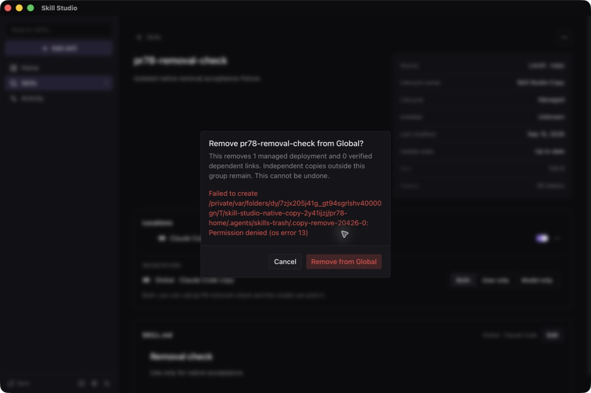

# Native removal error verification

Verified September 15, 2026 in the isolated `Skill Studio Copy Test.app`, using
the actual Tauri webview and Rust commands. No browser or mocked IPC was used.

## Candidate and isolation

Base revision: `e328cddb276de421ac41f20ad67d99402e66cd8f`, plus the one-line
`overflow-wrap: anywhere` correction in `RemoveDeploymentsDialog.tsx`.
That file's Git blob is `a6b9dd05bed41ae4be74ff10ab32b970ba8abafd`.
The ad-hoc-signed test executable SHA-256 is
`5d081ccc2a14d1170659a260cb807d111c2553b03fdb333a5c3ebdda5ab08f65`.
This is a test artifact, not a signed or notarized distribution build.

The existing sandbox blocked network access, reads from the real user home,
and writes outside the test roots. A separate `pr78-home` contained one synthetic
Claude Code Copy deployment. The existing fixture home and database were not
used. The launcher set both `HOME` and `CFFIXED_USER_HOME` to that separate home.

## Passed cases

1. Open Skills, select `pr78-removal-check`, then choose the Claude Code location's
   removal action. The confirmation names Global scope, one deployment, zero
   dependent links, and states that removal cannot be undone.
2. Make the fixture's `.agents/skills-trash` directory read-only (`0555`) before
   confirming. Rust refuses to create the removal staging directory. The dialog
   remains open with the real permission error and a matching toast. The original
   skill remains intact. In the first candidate, the inline error also remained
   after the toast disappeared.
3. A long filesystem path originally overflowed the dialog. After the wrapping
   correction, the same error fits inside the dialog and both buttons remain
   visible and usable. The incremental independent review found no issues.
4. Restore staging-directory permissions to `0755` and retry in the same dialog.
   The dialog closes after success. The native page reports that the skill is
   no longer installed. Filesystem and registry inspection confirms that both
   the deployment directory and its Copy ownership record were removed.

## Failed case: partial removal hides the dialog

On the base candidate, making `.claude/skills` read-only while leaving its child
skill directory writable caused a different failure: recursive removal deleted
`SKILL.md`, but could not remove the enclosing directory. Rollback also failed
under the same permission restriction. An intact 140-byte `SKILL.md` backup
remained under `.agents/skills-trash/.copy-remove-<pid>-0/0/`.

The UI first displayed the failure, then a filesystem refresh removed the skill
from the snapshot. `SkillPage` rendered “This skill is no longer installed,”
which unmounted the location dialog and its persistent error. This is not a
passing recovery or durable-feedback case. The backend's destructive sequence
and the parent page's missing-skill branch are unchanged by the wrapping fix.

The fixture was restored from the retained backup with byte equality verified.
The shared-core recovery integration must address this case and preserve access
to failure/recovery details when a deployment disappears. PR #78 alone does not
certify all Copy removal failure cases. This reproduction uses only synthetic
data; never apply these permission changes to a user's real skill directories.

## Checks and resource use

- Scoped `oxlint --deny-warnings` passed for the changed dialog.
- `NODE_OPTIONS=--max-old-space-size=3072 npm run build --workspace skill-studio`
  passed: 3.25 seconds wall, 1,023,868,928 bytes maximum RSS.
- `TAURI_CONFIG='{"identifier":"com.skillstudio.copy-test"}' CARGO_BUILD_JOBS=2
CARGO_TARGET_DIR=<compatible-cache> cargo build --offline --locked
--manifest-path apps/desktop/src-tauri/Cargo.toml --release
--features tauri/custom-protocol` passed: 53.06 seconds wall,
  1,466,368,000 bytes maximum RSS.
- The initial native build took 63.93 seconds and reported 1,450,360,832 bytes
  maximum RSS. It was rebuilt only after the native layout finding changed code.
- RSS values come from `/usr/bin/time -l`, not aggregate process-tree peaks.
  Native interaction latency and peak memory were not measured in this check.
- Preflight: 46–49% reported system memory free; 70 GiB disk available. Builds
  used two Rust workers and ran separately from native interaction.

The native process was stopped. The original test launcher and baseline binary
were restored. Temporary build logs, duplicate binaries, and fixture state were
removed after retaining this report, the selected screenshot, and the small
backup needed to reproduce the unresolved partial-removal case. No telemetry
was exported. The full suite was not repeated locally for this one-line change.
